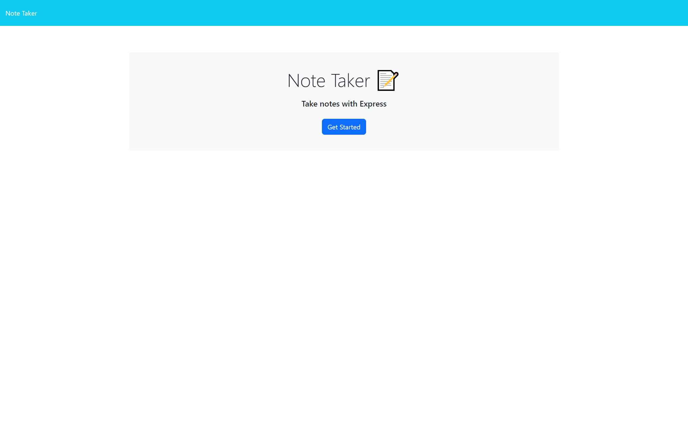
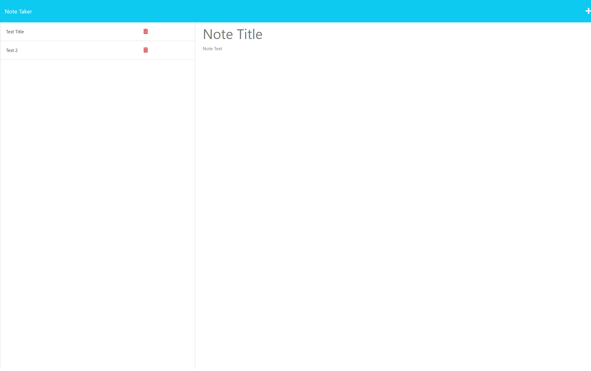
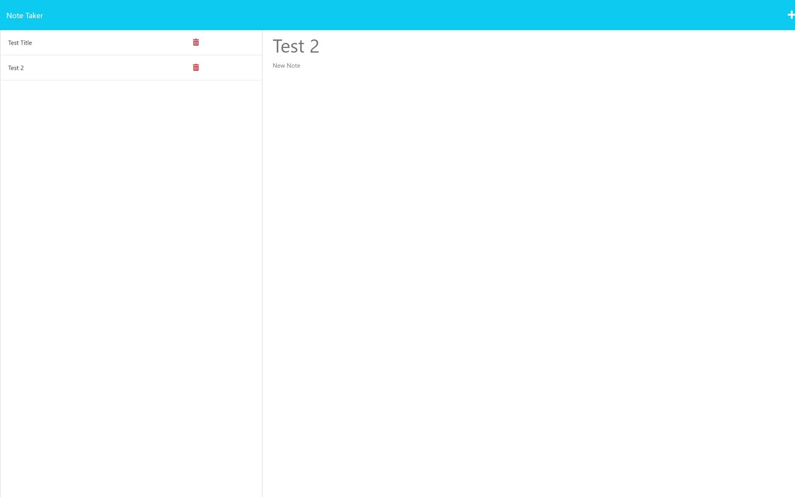

# Express-Note-Taker

## Description

Note taking application that can be used to write and save notes. This application can be used to keep track of notes a user makes to be referred back to at a later date.

## Installation

Open the repository in vscode and then, open the server.js in the integrated terminal. Once the terminal is opened type "npm i" into the console to install the required npms.

## Usage

Once server.js in opened in the integrated terminal type, "npm start" to startup the application and navigate to the browser with the link printed in the terminal. Click on the "get started" button in the browser. A page will appear where you can add a title and text to a note. Once finished adding a note, click the save icon in the top right and you will see your created note appear on the left hand side of the page. Previous notes can be clicked on, to view. 

Deployed Application URL: https://fathomless-mesa-12632.herokuapp.com/

Homepage:

Notes page:

Viewing past notes:

